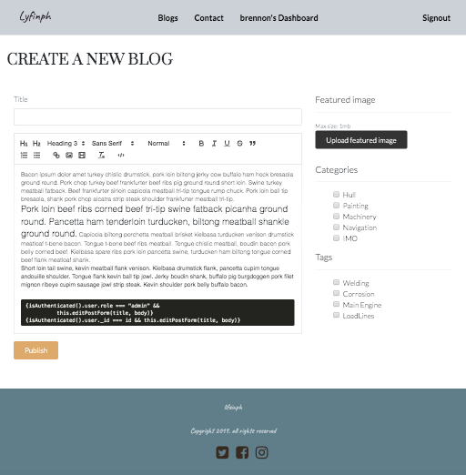
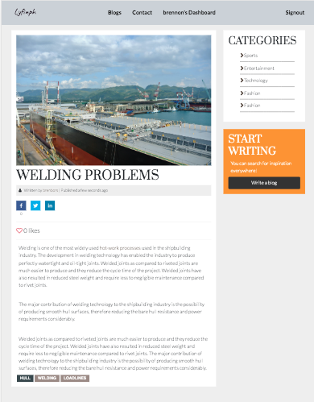

### MULTI-USER Blogging Platform with SEO

Before running the terminal, make sure to make a .env file on main project folder

```js
NODE_ENV=
APP_NAME=
PORT=
CLIENT_URL=
DATABASE_CLOUD=''
DATABASE_LOCAL=''
JWT_SECRET=
SENDGRID_API_KEY=
EMAIL_TO=
EMAIL_FROM=
JWT_RESET_PASSWORD=
JWT_ACCOUNT_ACTIVATION=
GOOGLE_CLIENT_ID=
```

To run on terminal

```js
npm start
```

## App Screenshots




Back-end stack:

- Node.js
- Express.js
- MongoDB

1st commit:

- Basic Server set-up. Project started on 18th October 2019

2nd commit:

- Added routes and controllers set-up
- Completed Node API Basic Set-up

3rd commit:

- Completed User signup and signin
- Added middleware for protected routes

4th commit :

- Completed create, read and delete tags and categories functionality

5th commit:

- Added Blog API

6th commit:

- Added Related Blogs API

7th commit:

- Added Search Blog API

8th commit:

- Added User Public profile API
- Creating blogs by authenticated user API

9th commit:

- added forgot password API

10th commit:

- added account activation on sign-up API
- added Google sign-in API
- added Google analytics set-up

11th commit and beyond:

- added facebook, twitter and instagram to user model but not required

To-Do list:

- follow / unfollow still not working on both routes and controller

Must add features:

- like / unlike blog posts
- follow / unfollow user
- uploading multiple images blog
